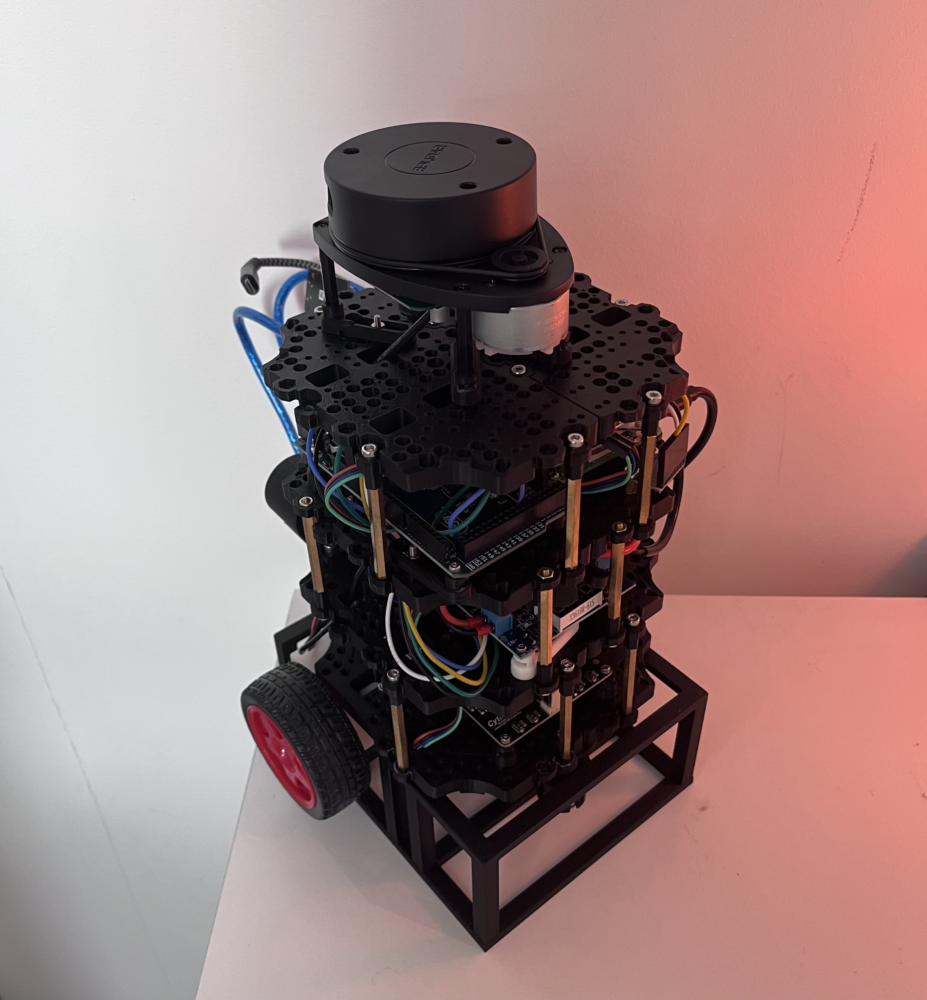
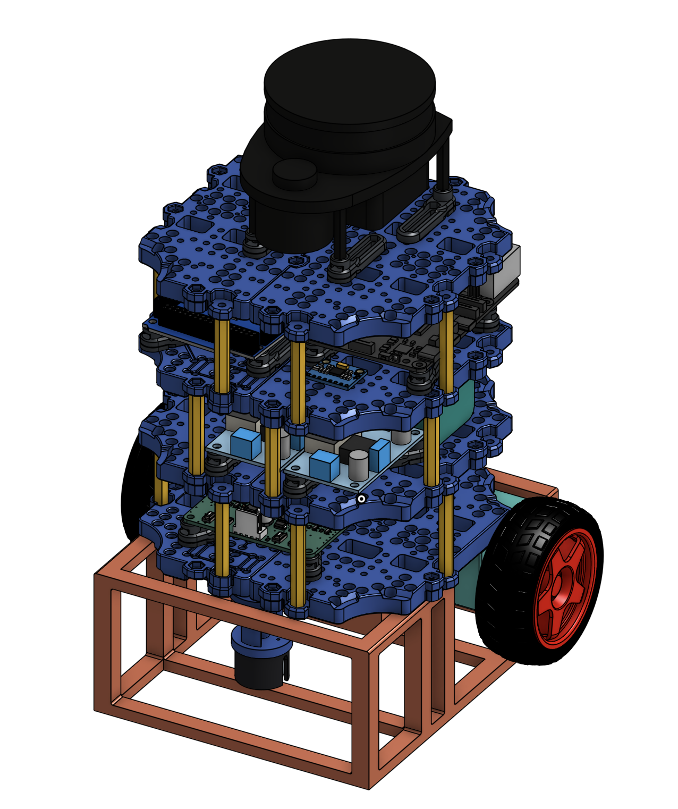

# ROS2 Autonomous Navigation Robot

Differential-drive robot running ROS2 Jazzy. The Pi handles hardware (motors, encoders, LiDAR, IMU) and publishes sensor topics. SLAM and Nav2 run on the workstation inside Docker.

<p align="center">
  
  
</p>

**[CAD model on OnShape](https://cad.onshape.com/documents/0aa8a7be9df8513ca999f15a/w/870686c64cc0b59c04b2a75d/e/d545bfa465fb1c9caba1e132)**

https://github.com/user-attachments/assets/bebb4963-49d7-4d1a-ad3a-12c27cb6cca2

## Repository structure

```
workstation/          Docker image + Nav2/SLAM config (runs on your laptop/desktop)
  Dockerfile
  docker-compose.yaml
  workspace/
    nav_launch.py     Nav2 bringup
    nav2_params.yaml
    slam_params.yaml
    maps/             Saved maps (nav2_map_server format)

robot/                Code that runs on the Raspberry Pi
  ros2_ws/
    my_robot/         Serial bridge (Pi↔Arduino) + odometry node
    my_robot_msgs/    WheelTicks custom message
  arduino/
    robot_firmware/   Motor control, encoder ISRs, IMU serial protocol
  scripts/
    control.py        Manual velocity test script
  .env                ROS2 env vars sourced on the Pi
  ROBOT_SPECS.md      Hardware dimensions, serial protocol, system architecture — [view](robot/ROBOT_SPECS.md)
```

---

## Pi setup

### 1. Flash Ubuntu Server 24.04 LTS (64-bit)

Use Raspberry Pi Imager. **Do not use Raspberry Pi OS** — it ships Python 3.13 and tinyxml2 v11, both incompatible with ROS2 Jazzy's pre-built binaries.

Set hostname, username/password, WiFi, enable SSH in Imager settings.

### 2. Update the system

```bash
sudo apt update && sudo apt full-upgrade -y
```

### 3. Fix held package versions

Ubuntu security updates bump these libraries ahead of what ROS2 expects:

```bash
sudo apt install -y --allow-downgrades \
  liblz4-1=1.9.4-1build1 \
  libzstd1=1.5.5+dfsg2-2build1 \
  zlib1g=1:1.3.dfsg-3.1ubuntu2 \
  libbz2-1.0=1.0.8-5.1
```

Do not run `apt upgrade` after this without re-pinning — the conflict returns.

### 4. Add ROS2 apt repository

```bash
sudo curl -sSL https://raw.githubusercontent.com/ros/rosdistro/master/ros.key \
  -o /usr/share/keyrings/ros-archive-keyring.gpg

echo "deb [arch=$(dpkg --print-architecture) signed-by=/usr/share/keyrings/ros-archive-keyring.gpg] \
  http://packages.ros.org/ros2/ubuntu $(. /etc/os-release && echo $UBUNTU_CODENAME) main" \
  | sudo tee /etc/apt/sources.list.d/ros2.list > /dev/null

sudo apt update
```

### 5. Install ROS2 Jazzy

```bash
sudo apt install -y ros-jazzy-ros-base
sudo apt install -y bzip2
sudo apt install -y python3-colcon-common-extensions python3-rosdep ros-dev-tools
sudo reboot
```

### 6. Configure environment

```bash
source /opt/ros/jazzy/setup.bash
echo "source /opt/ros/jazzy/setup.bash" >> ~/.bashrc
sudo rosdep init && rosdep update
```

### 7. Build the robot workspace

```bash
cd ~/robot/ros2_ws
colcon build
source install/setup.bash
```

### 8. Flash the Arduino

```bash
# Install arduino-cli (one-time)
curl -fsSL https://raw.githubusercontent.com/arduino/arduino-cli/master/install.sh | sh
sudo mv bin/arduino-cli /usr/local/bin/
arduino-cli core update-index
arduino-cli core install arduino:avr

# Compile and upload
arduino-cli compile --fqbn arduino:avr:mega ~/robot/arduino/robot_firmware
arduino-cli upload  --fqbn arduino:avr:mega --port /dev/ttyACM0 ~/robot/arduino/robot_firmware

# Verify Arduino is connected
ls /dev/ttyACM*   # should show /dev/ttyACM0
```

---

## Workstation setup

```bash
xhost +local:docker
cd workstation
docker compose up --build
```

RViz2 renders directly to your desktop.

---

## Workflows

### Run the robot (Pi)

```bash
cd ~/robot/ros2_ws && source install/setup.bash
ros2 launch my_robot robot.launch.py
```

For manual control:

```bash
ros2 run teleop_twist_keyboard teleop_twist_keyboard
```

Press `e` a few times to increase turn speed.

### Map a new area

SLAM runs on the workstation, not the Pi. The Pi just streams `/scan` and `/odom`.

1. Launch the Pi stack (above)
2. In the Docker container — start SLAM:
```bash
ros2 launch slam_toolbox online_async_launch.py use_sim_time:=false
```
3. Open RViz2 and add a Map display on `/map`:
```bash
rviz2
```
4. Drive around with teleop to build the map
5. Save when done:
```bash
ros2 run nav2_map_server map_saver_cli -f /workspace/maps/map
```

### Navigate with Nav2

1. Launch the Pi stack
2. In the Docker container:
```bash
ros2 launch nav2_bringup bringup_launch.py map:=/workspace/maps/map.yaml use_sim_time:=false
```
3. Open RViz2:
```bash
rviz2 -d $(ros2 pkg prefix nav2_bringup)/share/nav2_bringup/rviz/nav2_default_view.rviz
```
4. Click **2D Pose Estimate** → place the robot on the map
5. Click **Nav2 Goal** → click the destination

Verify the Pi's topics are visible before launching Nav2:
```bash
ros2 topic list   # should include /scan, /odom, /tf
```

### Convert serialized SLAM map to Nav2 format

SLAM Toolbox saves `.data` + `.posegraph`. Nav2 needs `.yaml` + `.pgm`:

```bash
# Terminal 1 — load the serialized map
ros2 run slam_toolbox async_slam_toolbox_node --ros-args \
  -p use_sim_time:=false \
  -p map_file_name:=/workspace/maps/map \
  -p mode:=localization

# Terminal 2 — activate and export
ros2 lifecycle set /slam_toolbox configure
ros2 lifecycle set /slam_toolbox activate
sleep 3
ros2 run nav2_map_server map_saver_cli -f /workspace/maps/converted_map
```

---

## Useful commands

```bash
# Kill everything ROS2
pkill -f "ros2 launch" && pkill -f slam_toolbox && pkill -f nav2 && pkill -f rviz2
ros2 daemon stop && ros2 daemon start

# Check topics
ros2 topic list
ros2 topic echo /odom
ros2 topic echo /scan --no-arr
```
